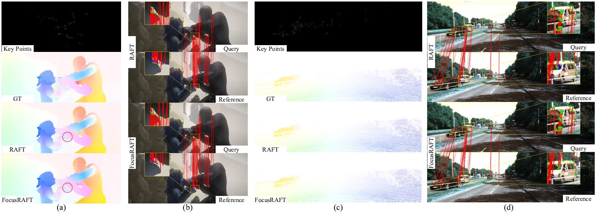
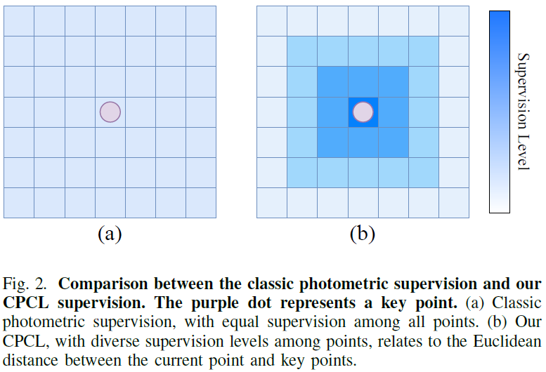
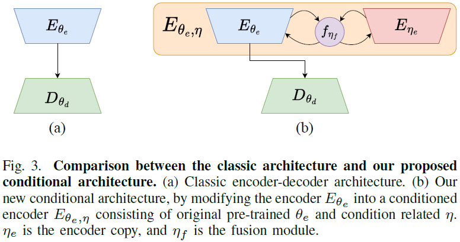
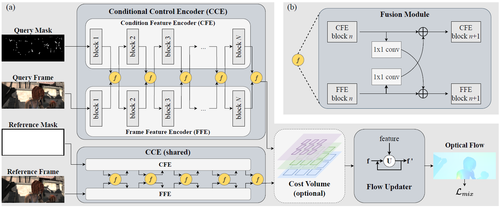

### <p align="center">FocusFlow: Boosting Key-Points Optical Flow Estimation for Autonomous Driving
<br>
<div align="center">
  <b>
  <a href="https://www.researchgate.net/profile/Zhonghua-Yi" target="_blank">Zhonghua&nbsp;Yi</a> &middot;
  <a href="https://www.researchgate.net/profile/Shi-Hao-10" target="_blank">Hao&nbsp;Shi</a> &middot;
  <a href="https://www.researchgate.net/profile/Kailun-Yang" target="_blank">Kailun&nbsp;Yang</a> &middot;
  <a href="https://www.researchgate.net/profile/Qi-Jiang-63" target="_blank">Qi&nbsp;Jiang</a> &middot;
  <a href="https://www.researchgate.net/profile/Yaozu-Ye" target="_blank">Yaozu&nbsp;Ye</a> &middot;
  <a href="https://www.researchgate.net/profile/Ze-Wang-42" target="_blank">Ze&nbsp;Wang</a> &middot;
  <a href="https://www.researchgate.net/profile/Kaiwei-Wang-4" target="_blank">Kaiwei&nbsp;Wang</a> 
  </b>
  <br> <br>

  <a href="https://arxiv.org/abs/2308.07104" target="_blank">Paper</a>

####
</div>
<br>
<p align="center">:hammer_and_wrench: :construction_worker: :rocket:</p>
<p align="center">:fire: We will release code and checkpoints in the future. :fire:</p>
<br>

<div align=center></div>

[comment]: <> (### Update)

[comment]: <> (- 2022.11.21 Release the [arXiv]&#40;https://arxiv.org/abs/2211.11293&#41; version with supplementary materials.)

### Update
- 2023.08.14 Init repository.

### TODO List
- [ ] Code release. 

### Abstract
Key-point-based scene understanding is fundamental for autonomous driving applications. 
At the same time, optical flow plays an important role in many vision tasks. 
However, due to the implicit bias of equal attention on all points, classic data-driven optical flow estimation methods yield less satisfactory performance on key points, limiting their implementations in key-point-critical safety-relevant scenarios. 
To address these issues, we introduce a points-based modeling method that requires the model to learn key-point-related priors explicitly. Based on the modeling method, we present FocusFlow, a framework consisting of 1) a mix loss function combined with a classic photometric loss function and our proposed Conditional Point Control Loss (CPCL) function for diverse point-wise supervision; 2) a conditioned controlling model which substitutes the conventional feature encoder by our proposed Condition Control Encoder (CCE). 
CCE incorporates a Frame Feature Encoder (FFE) that extracts features from frames, a Condition Feature Encoder (CFE) that learns to control the feature extraction behavior of FFE from input masks containing information of key points, and fusion modules that transfer the controlling information between FFE and CFE. 
Our FocusFlow framework shows outstanding performance with up to ${+}44.5\%$ precision improvement on various key points such as ORB, SIFT, and even learning-based SiLK, along with exceptional scalability for most existing data-driven optical flow methods like PWC-Net, RAFT, and FlowFormer. 
Notably, FocusFlow yields competitive or superior performances rivaling the original models on the whole frame.

## Method

<p align="center">
    Conditional Point Control Loss (CPCL)
</p>
<p align="center">
    <div align=center></div>
<br><br>

<p align="center">
    Conditional Architecture
</p>
<p align="center">
    <div align=center></div>
<br><br>

<p align="center">
    The FocusFlow Framework
</p>
<p align="center">
    <div align=center></div>
<br><br>


[comment]: <> (### Citation)

[comment]: <> (   If you find our paper or repo useful, please consider citing our paper:)

[comment]: <> (   ```bibtex)

[comment]: <> (   @article{shi2022flowlens,)

[comment]: <> (  title={FlowLens: Seeing Beyond the FoV via Flow-guided Clip-Recurrent Transformer},)

[comment]: <> (  author={Shi, Hao and Jiang, Qi and Yang, Kailun and Yin, Xiaoting and Wang, Kaiwei},)

[comment]: <> (  journal={arXiv preprint arXiv:2211.11293},)

[comment]: <> (  year={2022})

[comment]: <> (})

[comment]: <> (   ```)

### Contact
Feel free to contact me if you have additional questions or have interests in collaboration. Please drop me an email at yizhonghua@zju.edu.cn. =)